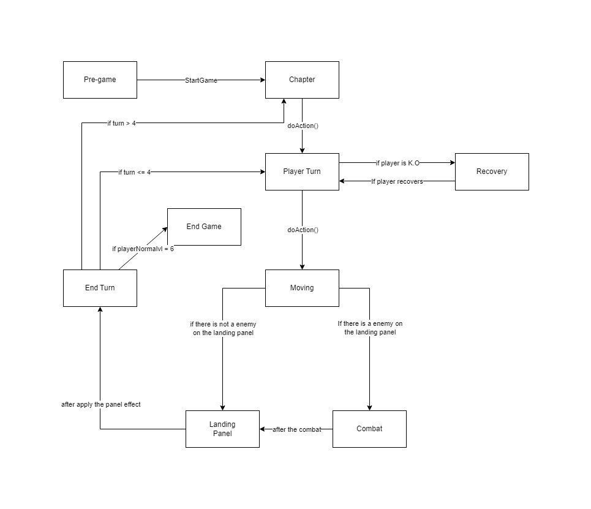

# 99.7% Citric Liquid

## About

`99.7% Citric Liquid` is a simplified clone of the renowned game, `100% Orange Juice`. Its main
purpose is to serve as an educational tool, teaching foundational programming concepts.

📢 **Note**: This project is purely educational and will not be used for any commercial purposes.

---

## For Students

* Las siguientes variables tienen valores default:
  * El método para subir de norma es Starts, existe el método necesario para cambiar el valor.
  * La cantidad de jugadores con la que se crea el GameBoard es 4.
  * Todos los jugadores comienzan su turno en su HomePanel.
  * GameBoard es un tablero fijo, esto significa que siempre posee los mismos paneles y en el mismo orden.

* Consideraciones:
  * Si un player vuelve de recovery aún tiene la posibilidad de jugar su turno.
  * Se hace un shuffle de la lista de jugadores original para determinar el orden de los jugadores, luego se hace una copia de esta para utilizarla
  durante el juego.
  * Si se detecta que el panel a donde nos moveremos tiene uno o más jugadores se comienza la batalla con el primero de la lista.
  * Los encounterPanel se inicializan durante la creación del GameBoard (se añade el WildUnit).
  * El combate tiene siempre el mismo funcionamiento, primero ataca el PlayerCharacter indicado en PlayerTurn, y luego el PlayerCharacter indicado
  en Enemy, el combate dura hasta que alguno de los dos llegue a hp=0.
  * Para los estados y su funcionamiento se utilizó el patrón State y el uso del método doAction() al igual que los auxiliares.
  * El funcionamiento del método encargado de sacar al PlayerCharacter del modo K.O es idéntico al enunciado.
  * StartGame se encarga de inicializar todos los elementos necesarios a utilizar durante el juego.

* Respecto a los tests:
  * No logré testear del todo el funcionamiento del observer, pero creo que el diseño del mismo es correcto, en este el observer es el GameController y
  el observable es el PlayerCharacter, la norma se encarga de notificar si al momento de hacer el levelUp la siguiente norma es de level 6.
  * En el momento de entrega se tiene un 92% de coverage, aunque es verdad que faltó testear algunos métodos importantes.

* Se actualizó el diagrama de estados:

    

    

This project is licensed under the [Creative Commons Attribution 4.0 International License](http://creativecommons.org/licenses/by/4.0/).

---